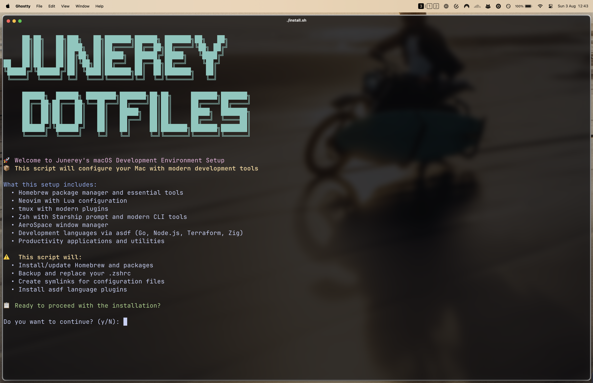

## Developer Mac Setup 👩🏻‍💻👨🏽‍💻👨🏻‍💻👩🏿‍💻

A comprehensive macOS dotfiles setup featuring modern development tools and configurations managed with GNU Stow and Homebrew.



## What's Included

### Core Development Tools
- **Neovim**: Lua-based configuration with modern plugins
- **tmux**: Terminal multiplexer with custom keybindings
- **Zsh**: Shell with Starship prompt and Antidote plugin manager
- **Git**: Version control with useful aliases and configurations

### Window Management & Terminal
- **AeroSpace**: i3-like tiling window manager for macOS
- **Ghostty**: Modern terminal emulator
- **Borders**: Colored window borders for enhanced visibility

### Development Environment
- **mise**: Version manager for Node.js, Go, Terraform, and Zig
- **OrbStack**: Docker Desktop alternative
- **Homebrew**: Package manager with comprehensive tool collection
- **just**: Command runner for repeatable maintenance tasks

### Productivity Tools
- **1Password**: Password manager with CLI integration
- **Raycast**: Application launcher and productivity suite
- **Obsidian**: Note-taking and knowledge management
- **Bruno**: API testing client

### Command Line Utilities
- **Modern replacements**: `eza` (ls), `bat` (cat), `fd` (find), `ripgrep` (grep)
- **Navigation**: `zoxide` (cd), `fzf` (fuzzy finder)
- **Monitoring**: `htop`, `btop`, `k9s` (Kubernetes)
- **Database**: `rainfrog` (TUI database client)

### Languages & Frameworks
Pre-configured for:
- **Go**: With mise version management
- **Node.js**: With npm/yarn support
- **Terraform**: With tflint for linting
- **Zig**: Modern systems programming language

## Installation

1. Update macOS to the latest version with the App Store
2. Install Xcode from the App Store, open it and accept the license agreement
3. Install macOS Command Line Tools by running `xcode-select --install`
4. Generate or restore SSH keys in `~/.ssh` and make sure private keys are `600`
5. Clone this repo to `~/.dotfiles`
6. Run `./install.sh` to start the installation
7. Restart your terminal or computer to load the shell changes
8. Run `just doctor` to verify the setup

If `just` is not available yet, run `./scripts/doctor.sh` directly after installation.

## Configuration Management

This setup uses **GNU Stow** for symlink management with a two-tier structure:

```
dotfiles/
├── home/            # Files symlinked to ~/
│   ├── .zprofile    # Login-shell environment
│   └── .zshrc       # Shell configuration
├── config/          # Files symlinked to ~/.config/
│   ├── nvim/        # Neovim configuration
│   ├── tmux/        # tmux configuration  
│   ├── aerospace/   # AeroSpace window manager
│   ├── starship/    # Shell prompt
│   ├── ghostty/     # Terminal emulator
│   ├── k9s/         # Kubernetes CLI
│   └── rainfrog/    # Database client
├── aliases.zsh      # Shell aliases (sourced by .zshrc)
├── justfile         # Dotfiles maintenance commands
├── path.zsh         # PATH configuration
├── scripts/         # Health checks and automation
└── install.sh       # Setup script
```

The installation script automatically applies both configuration tiers:
```bash
stow --restow -t ~ home
stow --restow -t ~/.config config
```

`.zprofile` owns login-shell environment setup. `.zshrc` owns interactive behavior such as completions, aliases, prompt, shell plugins, and fuzzy finder integration.

## Aliases & Shortcuts

The configuration includes numerous aliases for productivity:

- Navigation: `projects`, `desktop`, `downloads`, `dotfiles`
- Git: `gst` (status), `gsm` (smart-merge), `gsp` (smart-pull)
- Docker: `d` (docker), `dstop` (stop all), `dpurgecontainers`
- Editor: `v` (nvim)
- Window Management: `ff` (fuzzy window finder with AeroSpace)

## Maintenance

```bash
# List available maintenance commands
just

# Run the full health check
just doctor

# Run non-mutating config checks
just check

# Check missing Brewfile dependencies without requiring upgrades
just brew-check

# Install missing Brewfile dependencies
just brew-sync

# Check whether Brewfile packages are outdated
just brew-outdated

# Reload shell configuration
reloadcli

# Apply configuration changes
just restow

# Measure shell startup time
just shell-time

# Profile shell startup functions
just shell-profile
```

`just brew-check` uses `brew bundle check --no-upgrade`, so it reports missing dependencies without failing just because installed packages are outdated. Use `just brew-outdated` when you explicitly want the stricter up-to-date check.

## Health Checks

`just doctor` runs the same checks used during maintenance:

- Required tool availability
- Zsh syntax for `.zprofile`, `.zshrc`, `aliases.zsh`, and `path.zsh`
- ShellCheck for shell scripts
- GNU Stow dry-runs for home and XDG config packages
- Brewfile dependency check
- mise version resolution
- opencode config validation
- Neovim headless startup
- Interactive shell startup timing

Run `just doctor` after macOS upgrades, Homebrew changes, shell plugin changes, or when setting up a new machine.
