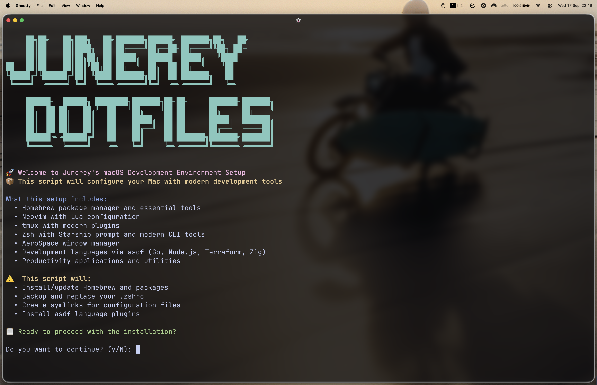

## Developer Mac Setup 👩🏻‍💻👨🏽‍💻👨🏻‍💻👩🏿‍💻

A comprehensive macOS dotfiles setup featuring modern development tools and configurations managed with GNU Stow and Homebrew.



## What's Included

### Core Development Tools
- **Neovim**: Lua-based configuration with modern plugins
- **tmux**: Terminal multiplexer with custom keybindings
- **Zsh**: Shell with Starship prompt and Antidote plugin manager
- **Git**: Version control with useful aliases and configurations

### Window Management & Terminal
- **AeroSpace**: i3-like tiling window manager for macOS
- **Ghostty**: Modern terminal emulator
- **Borders**: Colored window borders for enhanced visibility

### Development Environment
- **asdf**: Version manager for Node.js, Go, Terraform, and Zig
- **OrbStack**: Docker Desktop alternative
- **Homebrew**: Package manager with comprehensive tool collection

### Productivity Tools
- **1Password**: Password manager with CLI integration
- **Raycast**: Application launcher and productivity suite
- **Obsidian**: Note-taking and knowledge management
- **Bruno**: API testing client

### Command Line Utilities
- **Modern replacements**: `eza` (ls), `bat` (cat), `fd` (find), `ripgrep` (grep)
- **Navigation**: `zoxide` (cd), `fzf` (fuzzy finder)
- **Monitoring**: `htop`, `btop`, `k9s` (Kubernetes)
- **Database**: `rainfrog` (TUI database client)

### Languages & Frameworks
Pre-configured for:
- **Go**: With asdf version management
- **Node.js**: With npm/yarn support
- **Terraform**: With tflint for linting
- **Zig**: Modern systems programming language

## Installation

1. Update macOS to the latest version with the App Store
2. Install Xcode from the App Store, open it and accept the license agreement
3. Install macOS Command Line Tools by running `xcode-select --install`
4. Copy your public and private SSH keys to `~/.ssh` and make sure they're set to `600`
5. Clone this repo to `~/.dotfiles`
6. Append `/usr/local/bin/zsh` to the end of your `/etc/shells` file
7. Run `install.sh` to start the installation
8. Restart your computer to finalize the process

## Configuration Management

This setup uses **GNU Stow** for symlink management with a two-tier structure:

```
dotfiles/
├── home/            # Files symlinked to ~/
│   └── .zshrc       # Shell configuration
├── config/          # Files symlinked to ~/.config/
│   ├── nvim/        # Neovim configuration
│   ├── tmux/        # tmux configuration  
│   ├── aerospace/   # AeroSpace window manager
│   ├── starship/    # Shell prompt
│   ├── ghostty/     # Terminal emulator
│   ├── k9s/         # Kubernetes CLI
│   └── rainfrog/    # Database client
├── aliases.zsh      # Shell aliases (sourced by .zshrc)
├── path.zsh         # PATH configuration (sourced by .zshrc)
└── install.sh       # Setup script
```

The installation script automatically applies both configuration tiers:
```bash
stow -t ~ home       # Apply home directory configs
stow -t ~/.config config  # Apply XDG config directory configs
```

## Aliases & Shortcuts

The configuration includes numerous aliases for productivity:

- Navigation: `projects`, `desktop`, `downloads`, `dotfiles`
- Git: `gst` (status), `gsm` (smart-merge), `gsp` (smart-pull)
- Docker: `d` (docker), `dstop` (stop all), `dpurgecontainers`
- Editor: `v` (nvim)
- Window Management: `ff` (fuzzy window finder with AeroSpace)

## Maintenance

```bash
# Update all packages
brew bundle

# Reload shell configuration
reloadcli

# Apply configuration changes (done automatically by install.sh)
stow -t ~ home           # Apply home directory configs
stow -t ~/.config config # Apply XDG config directory configs

# Apply individual tool configs (if needed)
cd config && stow -t ~/.config <tool-name>
```
